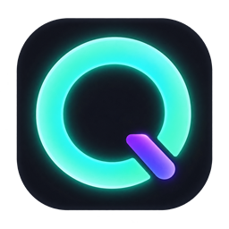

<p align="center">
  
</p>

<h1 align="center">Quota Halo</h1>

> 一個停駐在 Windows 螢幕邊緣的 AI 用量光環。

Quota Halo 會把 DeepSeek、OpenRouter、Claude、Codex 與 Antigravity 的額度集中在同一張輕量浮動卡片。平時收合成一顆低干擾的膠囊，滑鼠移入後展開完整用量；也能固定展開、移至螢幕上方或下方，並常駐系統匣。

本專案由 [Codenotch](https://github.com/vinzdg/codenotch) 的概念延伸而來，針對 Windows、跨供應商用量與本機憑證整合重新設計。

## 下載

目前版本：**v0.3.2**

- [下載 Quota Halo v0.3.2（Windows x64）](https://github.com/wjcudalearning/quota-halo/releases/download/v0.3.2/Quota-Halo-v0.3.2-win-x64.zip)
- [查看所有 Releases](https://github.com/wjcudalearning/quota-halo/releases)

解壓縮後執行 `Quota Halo.exe` 即可，不需要安裝。系統需求為 Windows 10/11 x64。

## 功能特色

- 五個 AI 服務的用量與餘額集中顯示
- 收合膠囊與展開卡片之間平順切換
- 支援螢幕上緣、下緣與多螢幕位置記憶
- 可固定展開、開機自動啟動及調整輪詢頻率
- 網路暫時失敗時保留最後一次成功讀值，並標示為過期資料
- 繁體中文與英文介面
- OpenRouter 金鑰使用 Windows DPAPI 保護
- 舊版 Codenotch 設定首次啟動時自動遷移

## 支援的供應商

| 供應商 | 顯示內容 | 資料來源 |
|---|---|---|
| **DeepSeek** | 可用美元餘額 | `~/.dsh/.credentials.yaml` 中的 `DEEPSEEK_API_KEY` |
| **OpenRouter** | 帳號預付餘額，或金鑰自身的額度上限 | 自動讀取 DSH 憑證檔中的 `OPENROUTER_API_KEY`，也可由設定頁或環境變數覆寫 |
| **Claude** | 圓圈顯示當前 session 剩餘比例；詳細頁顯示各時段已使用比例 | Claude Code OAuth；失效時自動使用 Claude Desktop 官方本機用量快取 |
| **Codex** | 5 小時與每週用量 | `~/.codex/auth.json` |
| **Antigravity** | Gemini 配額；無授權配額時顯示今日請求數 | Windows Credential Manager 與本機活動紀錄 |

環形顏色代表目前狀態：綠色正常、黃色需要留意、橘紅色代表用量危急、憑證過期或需要登入。

## OpenRouter 設定

只要在 DeepSeek Harness／DSH 的 `~/.dsh/.credentials.yaml` 設定 `OPENROUTER_API_KEY`，Quota Halo 就會自動沿用，不需要再次貼到設定頁。設定頁與 `OPENROUTER_API_KEY` 環境變數可用來覆寫 DSH 值。

程式會直接嘗試帳號餘額 API，不會只憑 `is_management_key` 欄位阻擋一般金鑰；只有 OpenRouter 實際拒絕 `/credits` 時，才會改顯示金鑰本身的限額或提示使用 Management API Key。

Quota Halo 使用目前的 OpenRouter 端點：

- `GET https://openrouter.ai/api/v1/key`
- `GET https://openrouter.ai/api/v1/credits`

## Claude 串接

Quota Halo 會優先使用 `~/.claude/.credentials.json` 中的 Claude Code OAuth 憑證讀取即時用量，並在可行時更新過期的 access token。

如果 Claude Code 登入已過期，但 Claude Desktop 仍在使用，程式會自動讀取 Claude Desktop 定期寫入的本機用量快取。這個備援只讀取使用百分比，不會擷取、解密或複製 Claude Desktop 的登入權杖。詳細卡片會以「桌面快取」標示資料來源。

Claude 圓圈中央的數字代表 **當前 session 剩餘百分比**；圓環顏色與詳細頁進度條仍依已使用比例計算，因此接近用完時會正確顯示警示色。

若兩種來源都不可用，請開啟 Claude Desktop，或在終端機重新登入 Claude Code。

## 使用設定

從系統匣圖示或展開卡片右上角的齒輪開啟設定，可以：

- 啟用或停用各供應商
- 檢查 DSH 內的 OpenRouter 金鑰，或設定選用的覆寫金鑰
- 選擇 DeepSeek 憑證檔與金鑰名稱
- 切換上方或下方螢幕邊緣
- 固定卡片展開
- 設定登入時自動啟動
- 調整更新頻率、置頂層級、通知與介面語言
- 使用認證檢查確認程式實際找到的資料來源

## 本機開發

需要 Node.js 與 npm。

```powershell
npm install
npm start
```

測試與封裝：

```powershell
npm test
npm run lint
npm run package
npm run smoke
```

封裝輸出位於：

```text
dist/Quota Halo-win32-x64/Quota Halo.exe
```

設定 `SMOKE_LAUNCH=1` 後執行 `npm run smoke`，會額外啟動封裝版約六秒，確認應用程式可以正常開啟。

## 隱私與資料保存

- 所有用量資料皆由這台電腦直接向供應商端點或本機應用程式資料讀取。
- Quota Halo 不會建立互動式登入流程，也不會將憑證上傳到其他伺服器。
- OpenRouter 金鑰在 Windows 支援時使用 Electron `safeStorage`／DPAPI 加密。
- 設定儲存於 `%APPDATA%\Quota Halo\settings.json`。
- 最後一次成功讀值儲存於 `%APPDATA%\Quota Halo\last-state.json`，供離線或冷啟動顯示。
- 可攜版移除後不會自動刪除上述資料；不再使用時可手動刪除 `%APPDATA%\Quota Halo`。

## 已知限制

- Claude、Codex 與 Antigravity 的部分用量介面不是公開穩定 API，供應商更新後可能需要同步調整。
- Claude Desktop 快取不包含重置時間，因此使用此備援時只顯示用量百分比。
- 個人 Google 帳號通常無法取得 Antigravity 官方配額，程式會改用本機活動紀錄估算今日請求數。
- 部分供應商回傳的欄位名稱仍會以英文顯示。
- 全螢幕應用程式不會自動隱藏 Quota Halo；可在設定中把置頂層級切換成「一般」。

## 授權

MIT（詳見 `package.json`）。
